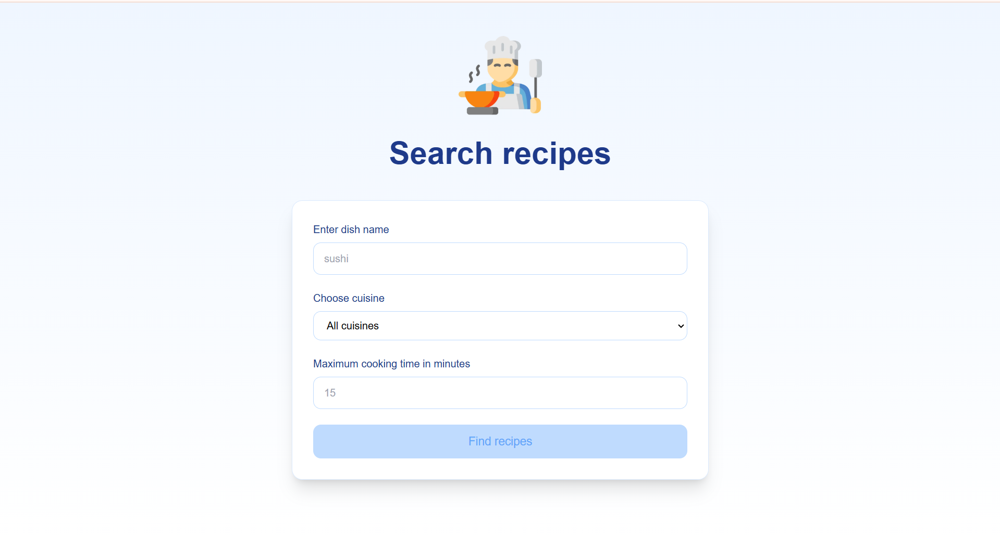
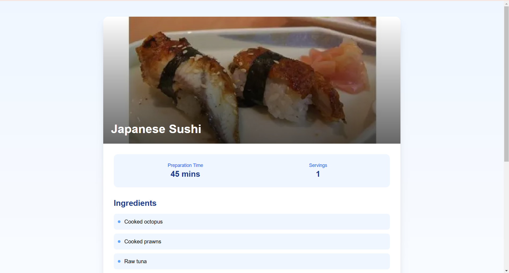
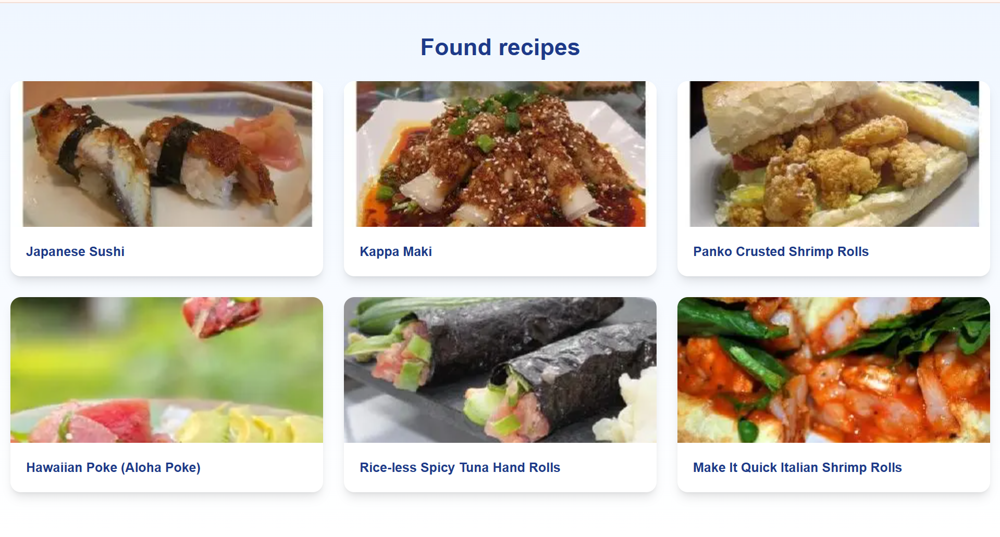

# Recipe Search Application

A modern recipe search application built with Next.js that allows users to discover recipes based on ingredients, cuisines, and preparation time.

## App features

- Search recipes by name, cuisine type, or preparation time
- Multiple international cuisines
- Maximum cooking time constraints
- Responsive design
- Modern UI
- Server-side rendering (optimal performance)

## Tech Stack

- **Framework**: Next.js (App Router)
- **Styling**: Tailwind CSS
- **API**: Spoonacular Recipe API

## Prerequisites

You need to have:
- Node.js 18+ installed
- A Spoonacular API key (https://spoonacular.com/food-api)

## Getting started

1. **Clone repository**
   ```bash
   git clone https://github.com/AzizZeynalli/recipes.git
   cd recipe-search-app
   ```

2. **Install dependencies**
   ```bash
   npm install
   ```

3. **Set up environment variables**
   
   Create a `.env.local` file in the root directory:
   ```env
   SPOONACULAR_API_KEY="your_api_key_here"
   ```

4. **Run dev server**
   ```bash
   npm run dev
   ```

5. **Open [http://localhost:3000](http://localhost:3000) in your browser**

## API routes

This app uses the following Spoonacular API endpoints:

- **recipe search**: 
  ```
  GET https://api.spoonacular.com/recipes/complexSearch
  ```
- **recipe details**: 
  ```
  GET https://api.spoonacular.com/recipes/{id}/information
  ```

## Screenshots
**Home page (recipe search)**


**Found recipes page**


**Recipe details page**
